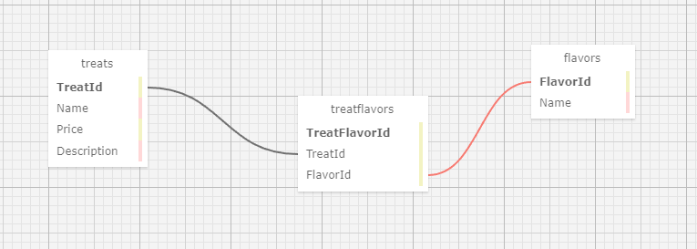

#  Sweet and Savory App

#### By: Jason Elijah Church

#### A web application where an authenticated user can view, create, edit, and delete Treats and Flavors from a database.

## Technologies Used
* C#
* Markdown
* Git Bash
* Razor
* SQL
* MySQL Workbench
* Visual Code Studio
* .NET

## Description:
This application was made utilizing C# and its .Net framework. The site features information based on Treat and Flavor options at a fictional diner, which are stored in a database with a many-to-many relationship to each other. Anyone can access the application splash page and view a list(or details) of Treats and Flavor options, but a user must be authenticated and authorized to create, edit, or delete entries from either the Treats or Flavor tables in the database. Links to access create, edit or delete options are hidden behind a branching check to see if the user is authenticated, and the routes themselves have the "Authorize" attribute attached to them to prevent a user from reaching a view they don't have access to by typing in its URL route. Functionality for a user to register and then log in/off from an account is handled by utilizing Microsoft.AspNetCore.Identity. 

## Setup/ Installation Requirements

1. Clone this repo.
2. Open your terminal (e.g. Terminal or GitBash) and navigate to this project's production directory called "SweetSavory" and create a new file called appsettings.json.
3. Within the appsettings.json file, add this line of code: { "ConnectionStrings": { "DefaultConnection": "Server=localhost;Port=3306;database=sweet_savory_database;uid=[your user id];pwd=[your password];"}}
4. The database structure for this project is stored in the Migrations directory. While still in the production directory ("SweetSavory"), run the command "dotnet ef database update" to automatically recreate the databse on your SQL server. Note: you will need to have dotnet-ef globally installed to utilize this tool. To do so, type in "dotnet tool install --global dotnet-ef --version 6.0.0" into your terminal. This is a visual representation of the database: 
5. While in the production folder of this application ("SweetSavory"), in the command line, run the command "dotnet watch run" to compile and execute the application.

## Known Bugs
Currently no known bugs. 

## License

MIT License

Copyright (c) (2023) Jason Elijah Church

Permission is hereby granted, free of charge, to any person obtaining a copy
of this software and associated documentation files (the "Software"), to deal
in the Software without restriction, including without limitation the rights
to use, copy, modify, merge, publish, distribute, sublicense, and/or sell
copies of the Software, and to permit persons to whom the Software is
furnished to do so, subject to the following conditions:

The above copyright notice and this permission notice shall be included in all
copies or substantial portions of the Software.

THE SOFTWARE IS PROVIDED "AS IS", WITHOUT WARRANTY OF ANY KIND, EXPRESS OR
IMPLIED, INCLUDING BUT NOT LIMITED TO THE WARRANTIES OF MERCHANTABILITY,
FITNESS FOR A PARTICULAR PURPOSE AND NONINFRINGEMENT. IN NO EVENT SHALL THE
AUTHORS OR COPYRIGHT HOLDERS BE LIABLE FOR ANY CLAIM, DAMAGES OR OTHER
LIABILITY, WHETHER IN AN ACTION OF CONTRACT, TORT OR OTHERWISE, ARISING FROM,
OUT OF OR IN CONNECTION WITH THE SOFTWARE OR THE USE OR OTHER DEALINGS IN THE
SOFTWARE.